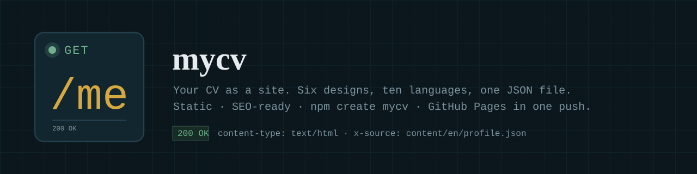
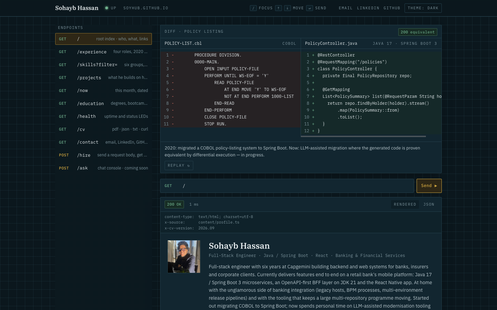

<p align="center">
  
</p>

<p align="center">
  A portfolio template where every section of your CV is an endpoint.<br>
  <code>GET /experience</code> · <code>GET /skills?filter=backend</code> · <code>POST /hire</code> — rendered as a small API explorer.<br>
  Static, SEO-ready, deploys to GitHub Pages on push.
</p>

<p align="center">
  <a href="https://soyhub.github.io">Live demo</a> ·
  <a href="#quick-start">Quick start</a> ·
  <a href="#make-it-yours">Make it yours</a> ·
  <a href="#what-you-get">What you get</a> ·
  <a href="#the-stack-explained">The stack</a> ·
  <a href="#the-chat-console-optional">Chat console</a>
</p>



## Why

Recruiters skim; engineers click. This site gives both something to do: an endpoint list with keyboard
navigation, a request bar you can type into, a response frame with a Rendered tab and a JSON tab, and
real machine-readable outputs (`/cv.json`, `/cv.txt`, `/llms.txt`) for the tools that read profiles
these days. Everything renders from **one typed file**, `content/profile.ts`, so the site, the JSON
Resume, the plain-text CV and the PDF never drift apart.

## Quick start

You need [Node.js](https://nodejs.org) 22+ and [pnpm](https://pnpm.io) (`corepack enable` gives you pnpm).

```bash
git clone https://github.com/SoyHub/SoyHub.github.io my-site
cd my-site
pnpm install
pnpm dev            # http://localhost:3000
```

Then edit the files in `content/` (see below), and:

```bash
pnpm test           # guards: no placeholders, no phone numbers, no denylisted names
pnpm build          # static export in out/ — also regenerates public/cv.pdf
```

## Deploy to GitHub Pages

1. Create a repository named `<your-username>.github.io` and push this code to its `main` branch.
2. In the repository: **Settings → Pages → Source: GitHub Actions**.
3. That's it. `.github/workflows/deploy.yml` builds and publishes on every push. The site URL is read
   from GitHub, so there is nothing to configure — `robots.txt`, `sitemap.xml`, canonical links and
   social-preview images all point at the right host.

Any other static host works too: `pnpm build` and upload the `out/` folder.

## Make it yours

Everything personal lives in `content/`. Nothing outside it mentions a person.

| Edit                     | To change                                                                                                                                                                    |
| ------------------------ | ---------------------------------------------------------------------------------------------------------------------------------------------------------------------------- |
| `content/profile.ts`     | Every CV fact: name, title, contact links, summary, three headline tiles, experience, projects, skills, education, languages. Typed — your editor tells you what goes where. |
| `content/site.ts`        | Page title and description, the social-preview subtitle, the hero caption, the request-bar easter egg, the chat's starter questions.                                         |
| `content/endpoints.ts`   | The endpoint list. Each entry has a method, path, title, one-line description and the SEO text of its page.                                                                  |
| `content/now.ts`         | The dated `/now` page.                                                                                                                                                       |
| `content/hero-diff.ts`   | The before/after code in the animated hero. Write your own — the sample is COBOL → Java.                                                                                     |
| `content/knowledge/*.md` | The chat console's corpus (also published as `/llms-full.txt`). Skip it if you don't switch the chat on.                                                                     |
| `public/photo.png`       | Your photo, square.                                                                                                                                                          |

To add an endpoint: add an entry in `content/endpoints.ts`, create `app/(explorer)/<path>/page.tsx`
(copy `education/page.tsx`), and put your view in `components/views/`. A test fails if the two lists
don't match.

Colours and fonts are CSS variables at the top of `app/globals.css`; light and dark themes are both
defined there. Fonts are IBM Plex (sans, mono, serif) loaded through `next/font`.

### Publishing rules

The tests refuse to build a site that contains a phone number, a date of birth, an unfilled
`[[placeholder]]`, or any name you list in `content/denylist.local.json` (gitignored — put former
clients and colleagues there). Describe clients by sector, not by name. See `content/README.md`.

## What you get

- **Every section is an endpoint** — a real page with its own URL, a Rendered tab and a JSON tab,
  response headers, and a latency chip. Keyboard: `/` focuses the request bar, `↑` `↓` move, `↵` sends.
- **Animated hero** — a before/after diff that "migrates" line by line and lands on `200 equivalent`.
- **`POST /hire`** — a JSON body the visitor edits; Send opens their mail client with it. Nothing is stored.
- **Machine-readable CV** — `/cv.json` ([JSON Resume](https://jsonresume.org)), `/cv.txt` (80 columns,
  ANSI colours for `curl`), `/cv.pdf` (generated from the same content at build time), `/llms.txt` and
  `/llms-full.txt` for crawlers that read.
- **SEO done** — per-page titles and descriptions, canonical URLs, Open Graph and Twitter cards with a
  generated image per page, `sitemap.xml`, `robots.txt`, a web manifest, and Person + WebSite JSON-LD
  built from your profile.
- **No cookies, no analytics, no tracking.** Dark and light theme, remembered locally.
- **Responsive** — works from 320px up; the endpoint list becomes a scroll strip on phones.

## The stack, explained

| Library                                                                         | Version | What it does here                                                                                                                                                                                                                                                                                        |
| ------------------------------------------------------------------------------- | ------- | -------------------------------------------------------------------------------------------------------------------------------------------------------------------------------------------------------------------------------------------------------------------------------------------------------- |
| [Next.js](https://nextjs.org)                                                   | 16      | The framework. App Router with React Server Components: pages render to static HTML at build time (`output: "export"`), so the site is plain files. Route handlers produce `cv.json`, `cv.txt`, `llms.txt`; metadata routes produce `sitemap.xml`, `robots.txt`, the manifest and the Open Graph images. |
| [React](https://react.dev)                                                      | 19      | UI. Client components only where there is interaction (request bar, tabs, keyboard nav, theme toggle, forms).                                                                                                                                                                                            |
| [Tailwind CSS](https://tailwindcss.com)                                         | 4       | Styling, with the palette declared once as CSS variables in `globals.css` and exposed as utilities (`text-brass`, `bg-sunk`, `border-hair`…).                                                                                                                                                            |
| [TypeScript](https://www.typescriptlang.org)                                    | 5       | Types for the content model (`content/profile.types.ts`) so a typo in your CV data fails the build, not the visitor.                                                                                                                                                                                     |
| [`next/og`](https://nextjs.org/docs/app/api-reference/functions/image-response) | —       | Renders the social-preview PNGs from JSX at build time (`lib/og.tsx`).                                                                                                                                                                                                                                   |
| [@react-pdf/renderer](https://react-pdf.org)                                    | 4       | Renders `content/profile.ts` to `public/cv.pdf` in `prebuild` (`scripts/build-pdf.tsx`) — the download can't drift from the site.                                                                                                                                                                        |
| [gray-matter](https://github.com/jonschlinkert/gray-matter)                     | 4       | Parses the front matter of the knowledge chunks for `/llms-full.txt` and the search index.                                                                                                                                                                                                               |
| [zod](https://zod.dev)                                                          | 4       | Validates chat requests and tool inputs (only used by the chat console).                                                                                                                                                                                                                                 |
| [@anthropic-ai/sdk](https://github.com/anthropics/anthropic-sdk-typescript)     | —       | Streams Claude answers with strict tools for the chat console (optional, see below).                                                                                                                                                                                                                     |
| [@upstash/ratelimit](https://github.com/upstash/ratelimit) + redis              | —       | Per-IP and daily caps for the chat console (optional).                                                                                                                                                                                                                                                   |
| [Vitest](https://vitest.dev) · ESLint · Prettier                                | —       | `pnpm test`, `pnpm lint`, `pnpm format`.                                                                                                                                                                                                                                                                 |

Scripts: `pnpm dev`, `pnpm build` (runs `prebuild`: search index + PDF), `pnpm test`, `pnpm lint`,
`pnpm typecheck`, `pnpm build-pdf`, `pnpm build-index`, `pnpm evals`.

## The chat console (optional)

`POST /ask` is a retrieval-grounded chat over your profile: hand-rolled BM25 plus optional
[Voyage](https://www.voyageai.com) embeddings fused with reciprocal rank fusion, Claude with strict
tools that render as UI blocks (timeline, skill matrix, project card, contact card, status codes),
scope enforced by the system prompt and measured by `evals/scope.jsonl`. It needs a server, so on the
static GitHub Pages build the page shows _coming soon_.

To switch it on, deploy to a Node host (Vercel works with zero config):

1. Copy `lib/chat/handler.ts` to `app/api/chat/route.ts` and remove `output: "export"` from `next.config.ts`.
2. Set the environment variables:

   | Variable                               | Purpose                                                                                              |
   | -------------------------------------- | ---------------------------------------------------------------------------------------------------- |
   | `ANTHROPIC_API_KEY`                    | Required. Usage is billed to you; the daily caps in `lib/chat/limits.ts` bound it.                   |
   | `VOYAGE_API_KEY`                       | Optional. Adds embeddings to retrieval; without it `pnpm build-index` writes a BM25-only index.      |
   | `KV_REST_API_URL`, `KV_REST_API_TOKEN` | Optional. Upstash Redis for rate limits and the daily spend cap (`UPSTASH_REDIS_REST_*` also works). |
   | `CHAT_DISABLED=1`                      | Kill switch.                                                                                         |
   | `CHAT_DENYLIST`                        | Comma-separated names the console must never say.                                                    |
   | `NEXT_PUBLIC_SITE_URL`                 | The public URL, for canonical links (set automatically on GitHub Pages).                             |

3. `pnpm evals` runs retrieval recall (offline) and the scope test (calls the model).

## Project layout

```
app/                Next.js routes: (explorer)/* pages, cv.json, cv.txt, llms.txt, sitemap, robots, OG images
components/         explorer/ (frame, request bar, endpoint list), views/ (one per endpoint), ui/, console/
content/            ← everything you edit
lib/                serializers (json-resume, json-ld, plain-text, llms-txt), seo, og, chat/, rag/
scripts/            build-pdf.tsx, build-index.ts
tests/  evals/      publishing guards, serializer tests, retrieval and scope evals
.github/            deploy workflow, brand assets
```

## License

[MIT](LICENSE). The profile content and photo describe a real person and are not part of the
licence — replace them with your own.
